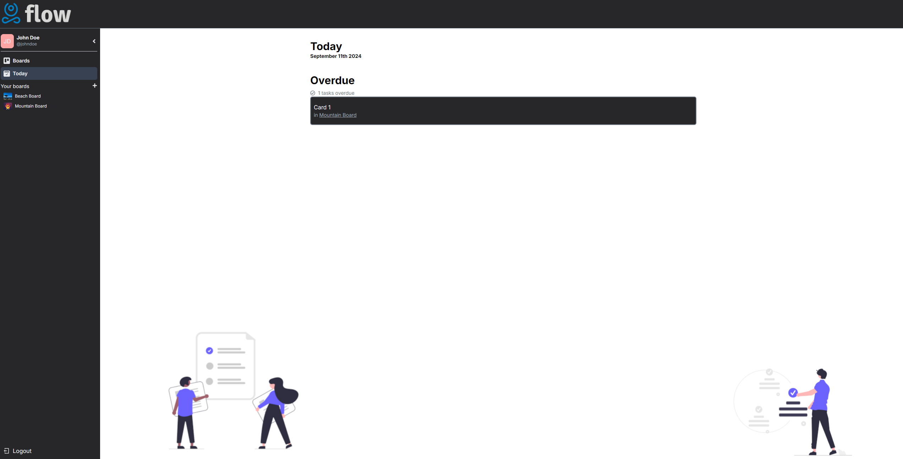

# Flow - Frontend

**Flow** is a Trello-like application designed for individual users to manage their tasks efficiently. This repository contains the frontend implementation of Flow using Next.js and Tailwind CSS.

## Features

- **Responsive Design:** Optimized for both desktop and mobile devices.
- **Task Management:** Create, update, and delete tasks effortlessly.
- **Drag-and-Drop:** Move tasks between different lists with a drag-and-drop interface.
- **Background Images:** Customize board backgrounds with pre-defined or custom images.

## Technologies Used

- **Next.js:** React framework for server-rendered applications.
- **Tailwind CSS:** Utility-first CSS framework for styling.
- **React:** JavaScript library for building user interfaces.

## Setup

To get started with the Flow frontend, follow these steps:

1. **Clone the Repository:**
    ```bash
    git clone https://github.com/niranjanblank/flow_frontend
    ```

2. **Navigate to the Project Directory:**
    ```bash
    cd flow-frontend
    ```

3. **Install Dependencies:**
    ```bash
    npm install
    ```

4. **Run the Development Server:**
    ```bash
    npm run dev
    ```

   This will start the development server at `http://localhost:3000`.

## Screenshots





